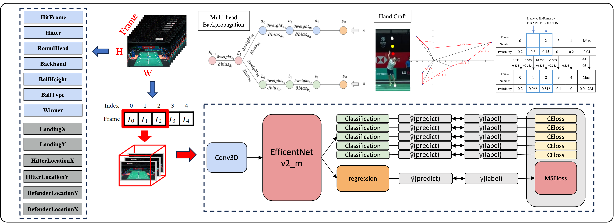

# Multitask Record for Badminton Match

## Overview



## Paper

Accepted for Oral Presentation at **APSIPA 2023**.
Link: <https://ieeexplore.ieee.org/abstract/document/10317491>

## Citation

```BibTeX
@INPROCEEDINGS{10317491,
  author={Guo, Jing-Ming and Huang, Yu-Shun and Chang, Ting-Yu and Ciou, Tai-Cyuan and Yeh, Yun-Ching and Chen, Jeffrey},
  booktitle={2023 Asia Pacific Signal and Information Processing Association Annual Summit and Conference (APSIPA ASC)},
  title={Multitask Record for Badminton Match},
  year={2023},
  volume={},
  number={},
  pages={2048-2052},
  keywords={Training;Asia;Information processing;Games;Multitasking;Task analysis;Videos},
  doi={10.1109/APSIPAASC58517.2023.10317491}}
```
